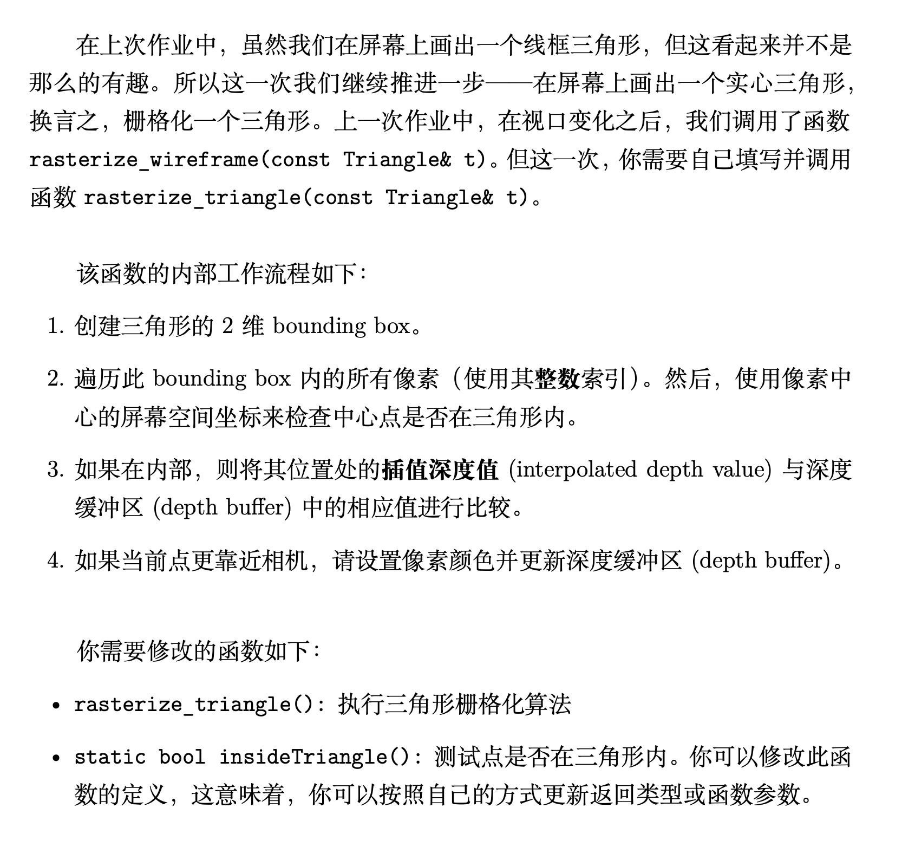
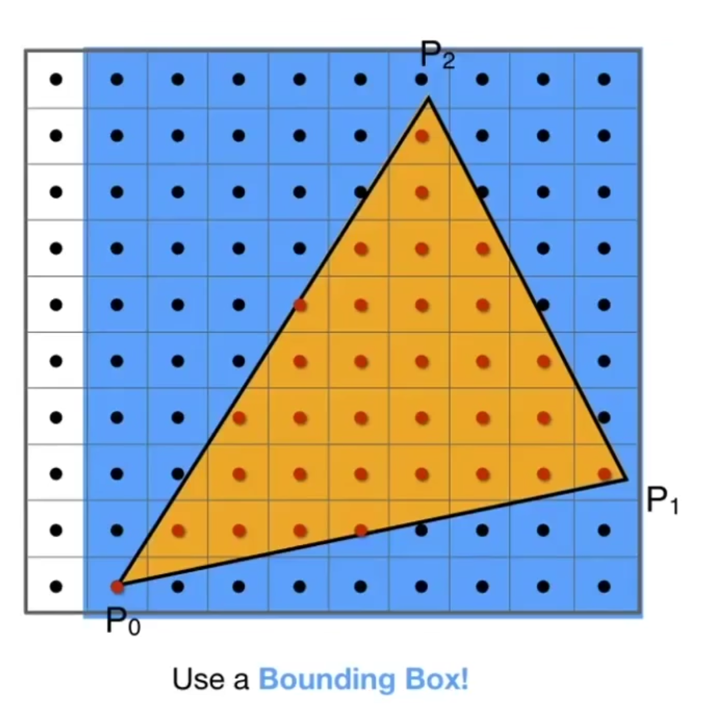
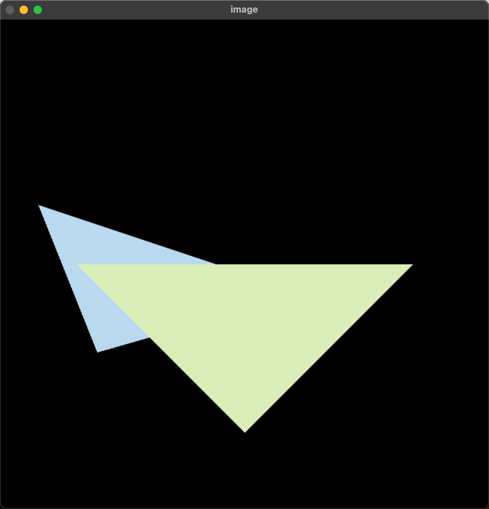

# GAMES101 作业2笔记

## 1. 作业要求



## 2. 作业代码

### 2.1 复制作业1的`get_projection_matrix`

```cpp
Eigen::Matrix4f::get_projection_matri(float eye_fov, float aspect_ratio, float zNear, float zFar){
    // Students will implement this functionl
    Eigen::Matrix4f projection = Eigen::Matrix4f::Identity();

    // TODO: Implement this function
    // Create the projection matrix for the given parameters.
    // Then return it.
    Eigen::Matrix4f m;
    m << zNear, 0, 0, 0,
        0, zNear, 0, 0,
        0, 0, zNear + zFar, -zNear * zFar,
        0, 0, 1, 0;
    float radian = eye_fov / 2 / 180.0 * MY_PI;
    float top    = tan(radian) * zNear;
    float bottom = -top;
    float right  = top * aspect_ratio;
    float left   = -right;

    Eigen::Matrix4f translate, scale;
    translate << 2 / (right - left), 0, 0, 0,
                 0, 2 / (top - bottom), 0, 0,
                 0, 0, 2 / (zNear - zFar), 0,
                 0, 0, 0, 1;

    scale << 1, 0, 0, -(right + left) / 2,
             0, 1, 0, -(top + bottom) / 2,
             0, 0, 1, -(zNear + zFar) / 2,
             0, 0, 0, 1;

    projection = translate * scale * m;

    return projection;
}

```

### 2.2 判断像素点在不在三角形内

先看看作业中给出的框架：

```cpp
static bool insideTriangle(int x, int y, const Vector3f* _v)
```

> x, y是点P的坐标
>
> \_v是三角形的三个顶点坐标
>
> > 这里\_v存的是三角形三个点分别的x,y,z信息，这段代码中不需要用到z坐标，所以用head函数把x,y坐标提取出来。

首先分别写出AB、BC、CA的向量用来指示三角形的边向量。
然后再从每个顶点出发，作到中心点P的向量。

如果P点同时在三条边的左侧或者右侧，即可认为点P在三角形ABC内。

也就是说，只需要同时满足下面的式子就行

$$
\begin{cases}
\vec{AB} \times \vec{AP} > 0 \\
\vec{BC} \times \vec{BP} > 0 \\
\vec{CA} \times \vec{CP} > 0 \\
\end{cases}

或

\begin{cases}
\vec{AB} \times \vec{AP} > 0 \\
\vec{BC} \times \vec{BP} > 0 \\
\vec{CA} \times \vec{CP} > 0 \\
\end{cases}
$$

综上所述，我们需要写出下面的代码：

```cpp
static bool insideTriangle(int x, int y, const Vector3f* _v)
{
    Eigen::Vector2f P(x, y);
    Eigen::Vector2f A = _v[0].head(2), B = _v[1].head(2), C = _v[2].head(2);

    Eigen::Vector2f AP = P - A;
    Eigen::Vector2f BP = P - B;
    Eigen::Vector2f CP = P - C;
    Eigen::Vector2f AB = B - A;
    Eigen::Vector2f BC = C - B;
    Eigen::Vector2f CA = A - C;

    float eq1 = AB[0] * AP[1] - AB[1] * AP[0];
    float eq2 = BC[0] * BP[1] - BC[1] * BP[0];
    float eq3 = CA[0] * CP[1] - CA[1] * CP[0];

    if (eq1 > 0 && eq2 > 0 && eq3 > 0) {
        return true;
    } else if (eq1 < 0 && eq2 < 0 && eq3 < 0){
        return true;
    } else {
        return false;
    }
}
```

要注意的点：

- 参数中`Vector3f* _v`表示的是一个Vector3f的数组，每个数组的的元素都是一个`Vector3f`。
- 本函数只做平面模拟，只需要用到x和y的坐标。
- Eigen做不了二维的向量叉乘，所以eq1~qe3都是手动叉乘。
  - 标准的叉乘结果应该还是向量，这里的算法是不标准但够用的。
    $$
    \vec{c} = \vec{a} \times \vec{b} =
    \left|
    \begin{array}{cccc}
    i & j & k \\
    a_x & a_y & a_z \\
    b_x & b_y & b_z
    \end{array}
    \right|
    $$

## 2.2 三角形光栅化

作业中给出的代码框架如下：

```cpp
void rst::rasterizer::rasterize_triangle(const Triangle& t)
```

### 2.2.1 找bounding box



找Bounding Box其实就是找三角形的三个顶点的x,y的最小值和最大值，这一段用min和max找就行了

这里要注意的就是三角形的坐标是float类型的，我们可以稍微扩大一点，让边界成为int，比较方便做for循环

### 2.2.2 判断点是否在三角形内

这里直接把`insideTriangle`函数套进去就行了，如果点在三角形内就往下走，不在的话继续循环。

### 2.2.3 根据已有代码来得到深度值，也就是z_interpolated

这里的代码框架中直接给出，取消注释就行了。

```cpp
// If so, use the following code to get the interpolated z value.
auto [alpha, beta, gamma] = computeBarycentric2D(x, y, t.v);
float w_reciprocal = 1.0 / (alpha / v[0].w() + beta / v[1].w() + gamma / v[2].w());
float z_interpolated = alpha * v[0].z() / v[0].w() + beta * v[1].z() / v[1].w() + gamma * v[2].z() / v[2].w();
z_interpolated *= w_reciprocal;
```

### 2.2.4 如果当前的位置深度小于`depth_buf[]`，就更新颜色值并保存深度

这里很简单，就是用z_buffer算法找一下最小值，找到了就覆盖就行。其中`depth_buf[]`保存的就是最小值。

需要注意的地方：

**depth_buf**

这是代码框架中定义的一维浮点数数组

```cpp
std::vector<float> depth_buf;
```

这里的问题在于，我们需要使用的是x,y的坐标值，所以需要用框架中给出的`get_index`函数进行转换。

```cpp
int rst::rasterizer::get_index(int x, int y)
{
    return (height-1-y)*width + x;
}
```

**set_pixel**

```cpp
void rst::rasterizer::set_pixel(const Eigen::Vector3f& point, const Eigen::Vector3f& color)
{
    auto ind = (height-1-point.y())*width + point.x();
    frame_buf[ind] = color;

}
```

这个函数接受两个参数，`point`表示点坐标，`color`就是颜色值了。

综上所述，这里的代码如下：

```cpp
void rst::rasterizer::rasterize_triangle(const Triangle& t) {
    auto v = t.toVector4();

    // 找到Bounding Box
    float xmin = std::min(std::min(v[0].x(), v[1].x()), v[2].x());
    float xmax = std::max(std::max(v[0].x(), v[1].x()), v[2].x());
    float ymin = std::min(std::min(v[0].y(), v[1].y()), v[2].y());
    float ymax = std::max(std::max(v[0].y(), v[1].y()), v[2].y());

    xmin = (int)std::floor(xmin);
    ymin = (int)std::floor(ymin);
    xmax = (int)std::ceil(xmax);
    ymax = (int)std::ceil(ymax);

    // 遍历Bounding Box
    for (int x = xmin; x <= xmax; ++x) {
        for (int y = ymin; y <= ymax; ++y) {
            if (insideTriangle(x + 0.5, y + 0.5, t.v)) {
                // 算z_interpolated
                auto [alpha, beta, gamma] = computeBarycentric2D(x, y, t.v);
    float w_reciprocal = 1.0 / (alpha / v[0].w() + beta / v[1].w() + gamma / v[2].w());
    float z_interpolated = alpha * v[0].z() / v[0].w() + beta * v[1].z() / v[1].w() + gamma * v[2].z() / v[2].w();
    z_interpolated *= w_reciprocal;

                // 比较z_interpolated和depth_buf
                if (z_interpolated < depth_buf[get_index(x, y)]) {
                    set_pixel(Vector3f(x, y, z_interpolated), t.getColor());
                    depth_buf[get_index(x, y)] = z_interpolated;
                }
            }
        }
    }
}
```

## 3. 运行结果


